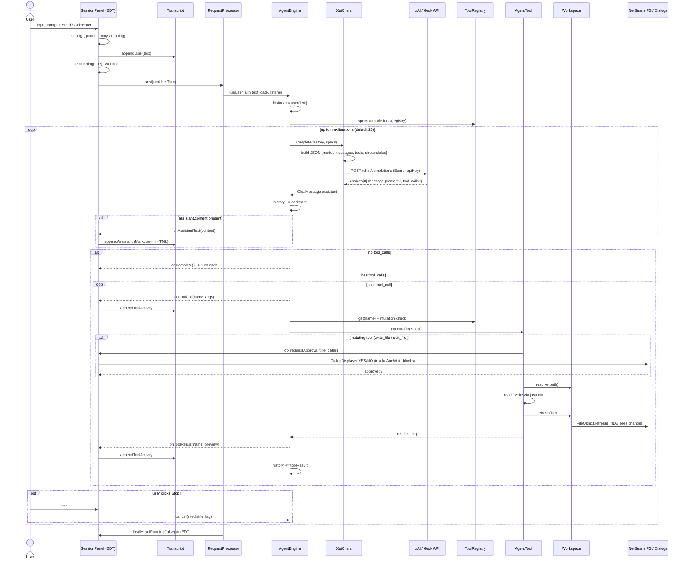

# Architecture

This document explains how the **xAI NetBeans** module works end to end: how the
plugin is structured, what happens when you type a prompt, how NetBeans and the
xAI (Grok) API talk to each other, and how the module executes the actions that
Grok asks for inside the IDE.


---

## 1. What this module is

`xai-netbeans` is an [Apache NetBeans](https://netbeans.apache.org/) Platform
module (packaging `nbm`) that embeds an agentic coding assistant powered by the
xAI Grok API. It adds a **xAI Assistant** tool window where you chat with Grok.
Grok can read your project, search it, and (in agent modes) create and edit
files — all through an OpenAI-compatible *function calling* loop.

Key facts:

- **Java 17**, built against NetBeans `RELEASE240` (NetBeans 24).
- HTTP via the JDK's built-in `java.net.http.HttpClient`.
- JSON via Gson; transcript rendering via commonmark.
- File actions go through `java.nio.file` and are reflected back into the IDE
  with `FileObject.refresh()` — there is **no** editor-buffer integration and
  **no** shell/command execution.

---

## 2. High-level component map

```
XaiAssistantTopComponent        (the tool window; hosts N tabs)
  └── SessionPanel              (one chat session per tab)
        ├── Transcript          (read-only HTML conversation view)
        ├── AgentEngine         (owns history + runs the agent loop)
        │     ├── List<ChatMessage> history   ← conversation state
        │     ├── XaiClient      → HTTP → xAI / Grok API
        │     ├── ToolRegistry   (the 5 callable tools)
        │     │     ├── ReadFileTool, ListDirTool, SearchTool   (read-only)
        │     │     └── WriteFileTool, EditFileTool             (mutating)
        │     └── SystemPrompts.forMode(Mode)
        └── XaiSettings          (read at runtime)

XaiOptionsPanelController → XaiOptionsPanel → XaiSettings → NbPreferences
```

### Packages

| Package     | Responsibility |
|-------------|----------------|
| `api`       | HTTP transport (`XaiClient`) and the wire data model (`ChatMessage`, `ToolCall`, `ToolSpec`, `XaiException`). |
| `core`      | `Mode` enum, `SystemPrompts`, and the `AgentEngine` tool-calling loop. |
| `settings`  | `XaiSettings` (NbPreferences-backed config) and the Tools → Options panel. |
| `tools`     | The `AgentTool` implementations, `ToolRegistry`, `ToolContext`, and `Workspace` path resolution. |
| `ui`        | `XaiAssistantTopComponent`, `SessionPanel`, `Transcript`. |

---

## 3. The five layers, in detail

### 3.1 UI layer (`ui`)

**`XaiAssistantTopComponent`** — the NetBeans tool window (opens on the right,
reachable via **Window → xAI Assistant**). Its toolbar offers **New Task**
(`Mode.AGENT`), **New Ask** (`Mode.ASK`), and **Close Tab**. The center is a
`JTabbedPane` of `SessionPanel`s. Each tab is a fully independent conversation.
Only `version=1.0` is persisted — **conversations are not saved across IDE
restarts**.

**`SessionPanel`** — a single conversation. It holds:

- a `Transcript`,
- a `JTextArea` prompt input,
- a `Mode` combo box,
- **Send** / **Stop** buttons and a status label,
- its own `AgentEngine`,
- a reference to the in-flight `RequestProcessor.Task`.

Agent turns run on a shared, bounded background pool so multiple tabs can work
in parallel:

```java
private static final RequestProcessor RP = new RequestProcessor("xAI-Assistant", 8, true);
```

**`Transcript`** — a read-only `JEditorPane` that renders the conversation as
HTML: user lines, Grok answers (Markdown → HTML via commonmark), tool-activity
bullets, info lines, and errors. Links open through NetBeans'
`HtmlBrowser.URLDisplayer`.

### 3.2 Core engine (`core`)

**`Mode`** decides which tools are exposed and whether mutations are allowed:

| Mode        | Mutations | Tools exposed       | Intent |
|-------------|-----------|---------------------|--------|
| `ASK`       | no        | read-only (3)       | answer questions, cite files/lines |
| `PLAN`      | no        | read-only (3)       | produce a numbered change plan |
| `DEBUG`     | no        | read-only (3)       | hypothesis → evidence → root cause |
| `AGENT`     | yes       | all (5)             | full autonomy, prefers `edit_file` |
| `MULTITASK` | yes       | all (5)             | same as AGENT, run across parallel tabs |

**`SystemPrompts.forMode(Mode)`** builds the single system message: identity
("xAI coding assistant embedded in Apache NetBeans"), the workspace root path,
path-resolution rules, the instruction to use tools rather than invent file
contents, and a mode-specific block of behavior.

**`AgentEngine`** is the heart of the module. It owns the conversation `history`
and runs the agent loop (see §5). One `AgentEngine` exists per session; changing
the mode combo constructs a **new** engine with a fresh system prompt and an
empty history (the old transcript stays on screen but is no longer sent to the
API).

### 3.3 API layer (`api`)

**`XaiClient`** is a thin, **non-streaming** client for the xAI Chat Completions
endpoint (OpenAI-compatible):

```
POST {baseUrl}/chat/completions      // default base: https://api.x.ai/v1
Authorization: Bearer <apiKey>
Content-Type: application/json
```

Request body:

```json
{
  "model": "grok-code-fast-1",
  "temperature": 0.2,
  "stream": false,
  "messages": [ /* full history, encoded */ ],
  "tools": [ /* ToolSpec.toWire(), only if non-empty */ ],
  "tool_choice": "auto"
}
```

`encodeMessages` maps each `ChatMessage` to the wire shape (`system` / `user` /
`assistant` / `tool` roles; `tool_call_id` and `name` for tool results;
`tool_calls[]` for assistant function calls). `parseAssistant` reads
`choices[0].message`, pulling out `content` (nullable) and any `tool_calls`,
returning a `ChatMessage.assistant(content, toolCalls)`.

Errors become an `XaiException`: missing key (before the call), HTTP non-2xx
(with the API's `error.message` if present), or network/interrupt failures.

The supporting data model:

- `ChatMessage` — role + content (+ tool-call metadata), with factory methods
  `system`, `user`, `assistant`, `toolResult`.
- `ToolCall` — `(id, name, argumentsJson)` from the model.
- `ToolSpec` — a tool's function-calling definition; `toWire()` emits the JSON
  schema sent in `tools`.

### 3.4 Tools layer (`tools`) — how Grok's actions are executed

When Grok wants the IDE to *do* something, it emits a `tool_call`. The
`AgentEngine` looks the tool up in the `ToolRegistry` and runs it locally. Tools
operate on the **filesystem** and then ask NetBeans to refresh its view.

| # | Tool         | Function name | Mutating | What it does |
|---|--------------|---------------|----------|--------------|
| 1 | `ReadFileTool` | `read_file`  | no  | Read a file (optionally a line range); returns numbered lines. |
| 2 | `ListDirTool`  | `list_dir`   | no  | List a directory; skips `.git`, `target`, `node_modules`. |
| 3 | `SearchTool`   | `search`     | no  | Regex search across files (extension filter, size/result caps). |
| 4 | `WriteFileTool`| `write_file` | yes | Create/overwrite a file; requires approval. |
| 5 | `EditFileTool` | `edit_file`  | yes | Exact `old_string` → `new_string` replacement; requires approval. |

Supporting pieces:

- **`Workspace`** resolves paths. Roots are tried in order: an explicit
  `workspaceRoot` setting, then each open NetBeans project directory
  (`OpenProjects.getDefault()`), then `user.dir`. After a write it calls
  `refresh(file)` → `FileUtil.toFileObject(...).refresh()` so the IDE sees the
  change.
- **`ToolContext`** carries the approval gate (`requestApproval`) and an
  activity logger (`log`) into each tool.
- **`Schemas`** builds the JSON Schema for each tool's parameters and parses
  arguments (`str`, `integer`, `bool`).

Mutating tools (`write_file`, `edit_file`) call `ctx.requestApproval(...)`. If
`requireApproval` is on (default), the UI shows a NetBeans
`DialogDisplayer`/`NotifyDescriptor.Confirmation` dialog. Because this runs on
the background agent thread, the call uses `invokeAndWait` and **blocks the
agent** until you click Yes/No.

### 3.5 Settings layer (`settings`)

**`XaiSettings`** stores everything in `NbPreferences.forModule(...)`:

| Key                  | Default                  |
|----------------------|--------------------------|
| `apiKey`             | `""` (falls back to `XAI_API_KEY` env var) |
| `baseUrl`            | `https://api.x.ai/v1`    |
| `model`              | `grok-code-fast-1`       |
| `temperature`        | `0.2`                    |
| `maxAgentIterations` | `25`                     |
| `workspaceRoot`      | `""` (auto-detect)       |
| `requireApproval`    | `true`                   |

**`XaiOptionsPanel` / `XaiOptionsPanelController`** add a **xAI Assistant** page
under **Tools → Options → Advanced**. `update()` loads from settings;
`applyChanges()` writes back on Apply.

---

## 4. What happens when you enter a prompt

1. You type into the prompt `JTextArea` and submit with **Send** or
   **Ctrl+Enter**.
2. `SessionPanel.send()` runs: it ignores empty input or an already-running
   turn, clears the box, echoes your text into the transcript
   (`appendUser`), and flips the UI into the "Working..." state.
3. It posts `engine.runUserTurn(text, approvalGate, listener)` onto the
   background `RequestProcessor` (so the EDT stays responsive).
4. `AgentEngine` appends your message to `history` and drives the agent loop
   (next section), calling the xAI API and executing tool calls until Grok
   produces a final answer.
5. Listener callbacks (assistant text, tool calls, tool results, errors,
   completion) are marshalled back to the EDT and appended to the transcript.
6. When the turn ends, the `finally` block restores the idle UI state.

The **Stop** button calls `engine.cancel()`, which sets a `volatile` flag the
loop checks between steps.

---

## 5. The agent loop

`AgentEngine.runUserTurn` (see `core/AgentEngine.java`) is the request →
tool-call → tool-result loop. In pseudocode:

```
history += user(text)
specs = tools allowed by current Mode

for iteration in 0 .. maxIterations-1:          # default cap 25
    if cancelled: report + stop
    assistant = XaiClient.complete(history, specs)   # POST /chat/completions
    history += assistant
    if assistant.content: listener.onAssistantText(content)   # may fire mid-loop
    if assistant has NO tool_calls: listener.onComplete(); return   # turn done
    for each tool_call:
        result = dispatch(call)        # approval + execute + refresh
        history += toolResult(call.id, call.name, result)

# loop exhausted without a final answer:
listener.onActivity("Reached the maximum of N steps...")
```

`dispatch` looks the tool up, enforces the mode's mutation policy
(`ERROR: tool '...' is not allowed in <mode> mode.` for a mutating tool in a
read-only mode), parses the JSON arguments, executes the tool, and returns the
result string (errors are caught and returned as `ERROR ...` text so the model
can react).

Notes and consequences:

- **Every** API call sends the *entire* `history` (system + all prior user /
  assistant / tool messages). Conversation state lives only in
  `AgentEngine.history` for the lifetime of that engine.
- The loop continues automatically as long as Grok keeps emitting tool calls,
  up to `maxAgentIterations`.
- Because assistant text is emitted whenever a response includes content, a
  single user turn can produce multiple "Grok" blocks.
- The whole turn is non-streaming: the UI shows "Working..." until it finishes.

---

## 6. End-to-end sequence diagram



---

## 7. Threading model

- **EDT (Swing)** — all UI: input handling, transcript updates, approval
  dialogs. Engine callbacks are pushed back to the EDT with
  `EventQueue.invokeLater`.
- **`RequestProcessor` pool** (`"xAI-Assistant"`, 8 threads) — runs
  `runUserTurn`, the blocking HTTP call, and tool execution off the EDT. Up to 8
  sessions/tabs can run concurrently.
- **Approval bridge** — mutating tools block their background thread on
  `invokeAndWait` while the EDT shows the Yes/No dialog.

---

## 8. Notable design choices & limitations

1. **Non-streaming** — a turn blocks until the full response arrives.
2. **No editor integration** — edits go straight to disk via `java.nio` and are
   surfaced with `FileObject.refresh()`; unsaved editor buffers can be
   overwritten.
3. **No command execution** — there is no tool to run Maven, tests, or shell
   commands. Capabilities are the 5 filesystem tools only.
4. **Regex search, not the IDE index** — `search` scans files directly.
5. **No conversation persistence** — closing the IDE discards history; the
   transcript is display-only HTML and is never fed back to the engine.
6. **Mode switch resets the engine** — API context is cleared (the transcript
   remains visible).
7. **Approval blocks the agent thread** — by design, so the model waits for your
   decision before mutating files.
